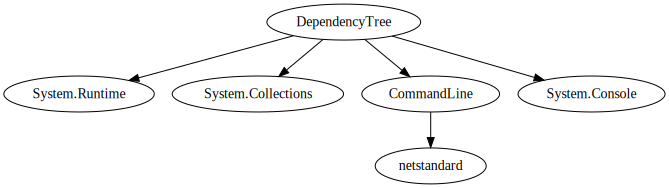

# DependencyTree

DependencyTree is a command-line tool for analyzing and visualizing the dependencies of .NET assemblies. It supports output in both text and DOT formats.

The DOT output can be visualized using tools like [Graphviz Online](https://dreampuf.github.io/GraphvizOnline/#digraph%20G%20%7B%0A%20%20%22DependencyTree%22%20-%3E%20%22System.Runtime%22%3B%0A%20%20%22DependencyTree%22%20-%3E%20%22System.Collections%22%3B%0A%20%20%22DependencyTree%22%20-%3E%20%22CommandLine%22%3B%0A%20%20%22CommandLine%22%20-%3E%20%22netstandard%22%3B%0A%20%20%22DependencyTree%22%20-%3E%20%22System.Console%22%3B%0A%7D%0A). The result looking something like this:



## Features

- Analyze .NET assembly dependencies.
- Output results in text format.
- Output results in DOT format for graph visualization.

## Installation

1. Clone the repository:
    ```sh
    git clone https://github.com/jarrettgilliam/DependencyTree.git
    cd DependencyTree
    ```

2. Build the project:
    ```sh
    dotnet build
    ```

## Usage

Run the tool with the required options:

```sh
DependencyTree -p <assembly-path> [-s <starts-with>] [-f <output-format>]
```

## Options
* `-p`, `--assembly-path` (required): The path to the root assembly.
* `-s`, `--starts-with`: Only include assemblies whose name starts with this value.
* `-f`, `--output-format`: The output format. Options are Text (default) and DOT.

## Examples

Analyze dependencies and output in text format:

```sh
DependencyTree -p /path/to/your/assembly.dll
```

Analyze dependencies and output in DOT format:

```sh
DependencyTree -p /path/to/your/assembly.dll -f DOT
```
